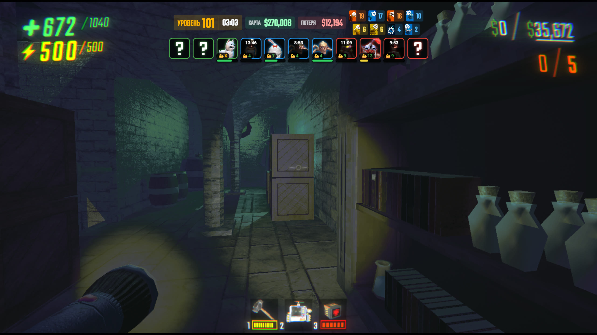
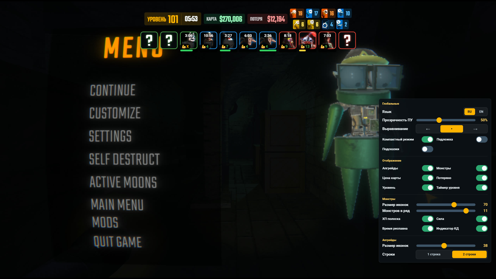
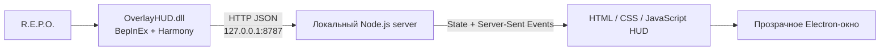

# OverlayHUD

Локальный HUD-оверлей для **R.E.P.O.**, который показывает информацию о текущем забеге в отдельном прозрачном окне поверх игры.

**Автор: EgorSalad**  
Текущая версия: **26.7.0**

> OverlayHUD — неофициальный фанатский проект. Он не связан с semiwork, издателем R.E.P.O. или Thunderstore.

## Как выглядит OverlayHUD

**HUD во время игры:**



**Панель настроек:**



## Что делает мод

OverlayHUD состоит из BepInEx-плагина и комплектного desktop-приложения. После запуска modded-версии игры плагин автоматически распаковывает и запускает приложение, синхронизирует с ним состояние текущего забега, а при выходе из игры закрывает его.

HUD умеет показывать:

- встреченных монстров и их уровень силы;
- текущее и максимальное здоровье монстров;
- состояние монстра и оставшееся время до респавна;
- номер уровня и таймер прохождения;
- улучшения игрока;
- текущую стоимость ценностей на карте;
- потерянную стоимость ценностей;
- отдельные timestamps прохождения уровней.

Монстры не раскрываются заранее. Плагин знает состав уровня для внутренней синхронизации статусов, но добавляет монстра в видимую часть HUD только после того, как игра зафиксировала встречу с ним.

## Возможности оверлея

- прозрачное окно поверх игры;
- пропуск кликов сквозь окно;
- перетаскивание и привязка к краям или центру экрана;
- изменение общего масштаба и отдельного масштаба улучшений;
- настройка количества колонок с монстрами;
- одинарная или двойная строка улучшений;
- русский и английский интерфейс;
- включение и отключение отдельных элементов HUD;
- настройка фоновой панели и прозрачности при наведении;
- скрытие HUD при удержании `Tab`;
- сохранение пользовательских настроек между запусками.

Для desktop-оверлея доступны глобальные горячие клавиши:

| Сочетание | Действие |
| --- | --- |
| `Ctrl+Alt+O` | Показать или скрыть окно |
| `Ctrl+Alt+I` | Включить или выключить пропуск кликов |
| `Ctrl+Alt+R` | Перезагрузить страницу оверлея |
| `Ctrl+Alt+Q` | Закрыть OverlayHUD |

Те же действия доступны через значок OverlayHUD в системном трее.

## Как это работает



### Игровой плагин

`overlay-hud/Plugin.cs` загружается через BepInEx и с помощью Harmony подписывается на игровые события:

- генерацию и смену уровня;
- создание, исчезновение и респавн врагов;
- события видимости и близости монстров;
- изменение здоровья монстров;
- получение улучшений;
- изменение, разрушение и сдачу ценностей.

Большая часть синхронизации событийная. Периодические проходы используются только как страховка, а reflection-метаданные, источники здоровья и результаты проверок компонентов кэшируются, чтобы снизить нагрузку на Unity.

### Локальный сервер

`server.js` хранит состояние HUD и принимает обновления от плагина через локальные `/api/...` endpoints. Страница оверлея получает новые состояния через Server-Sent Events и не выполняет постоянный тяжёлый polling.

В packaged-приложении сервер слушает только `127.0.0.1:8787`: данные не отправляются во внешний интернет, телеметрии нет.

> При ручном запуске через `start-server.bat` используется стандартный host из `server.js` — `0.0.0.0`. Такой режим может открыть порт `8787` в локальной сети. Для обычной установки через Gale это не используется.

### Desktop-приложение

`game-overlay/main.js` создаёт прозрачное click-through окно Electron, запускает встроенный сервер и открывает `http://127.0.0.1:8787/overlay.html`.

В Gale-пакете приложение хранится как `OverlayHUD_app.zip`. Это сделано намеренно: некоторые варианты импорта Gale изменяют структуру вложенных каталогов. Плагин безопасно распаковывает архив рядом с DLL в `OverlayHUD_app/` и запускает `OverlayHUD.exe` оттуда.

## Установка через Gale

1. Создайте или выберите профиль R.E.P.O. в Gale.
2. Импортируйте `OverlayHUD-<version>-flat.zip` как локальный мод.
3. Убедитесь, что в профиле установлен BepInExPack.
4. Запустите игру через кнопку запуска modded-версии.
5. При первом запуске дождитесь распаковки и автоматического старта `OverlayHUD.exe`.

Node.js и Electron отдельно устанавливать не требуется: desktop-приложение уже находится внутри пакета.

### Режим отображения игры

Используйте оконный или borderless-режим. Обычное desktop-окно не может отображаться поверх игры в exclusive fullscreen.

## Конфигурация

После первого запуска BepInEx создаёт файл:

```text
BepInEx/config/local.overlay.overlay_hud.cfg
```

Основные параметры:

| Секция и параметр | По умолчанию | Назначение |
| --- | ---: | --- |
| `Overlay.Endpoint` | `http://127.0.0.1:8787/api/monster-seen` | Endpoint встреченных монстров |
| `Overlay.LevelEndpoint` | `http://127.0.0.1:8787/api/level` | Endpoint смены уровня |
| `Detection.ScanIntervalSeconds` | `3` | Повторная попытка собрать roster при старте уровня |
| `Detection.StatusIntervalSeconds` | `10` | Страховочная полная синхронизация статусов |
| `Detection.PreferPlayerVisionDetection` | `true` | Использовать обнаружение через PlayerVision, когда оно доступно |
| `Debug.Logging` | `false` | Дополнительные диагностические строки в BepInEx-логе |
| `OverlayApp.AutoStart` | `true` | Автоматически запускать desktop-приложение |
| `OverlayApp.AutoClose` | `true` | Закрывать приложение при выходе из игры |
| `OverlayApp.ExecutableRelativePath` | `OverlayHUD_app/OverlayHUD.exe` | Путь к распакованному приложению |
| `OverlayApp.ArchiveName` | `OverlayHUD_app.zip` | Имя комплектного архива приложения |

Значения `StatusIntervalSeconds` меньше `10` автоматически поднимаются до безопасного значения `10`.

## Timestamps

Во время игры OverlayHUD создаёт текстовые файлы рядом с `OverlayHUD.exe`:

```text
OverlayHUD_app/timestamps/YYYY-MM-DD_HH-MM-SS.txt
```

Пример строки:

```text
22:14:09 Level 42 Wizard [Peeper, Gnomes x8, Headman]
```

Поддерживаемые короткие названия карт: `Manor`, `Museum`, `Wizard`, `Arctic`.

## Диагностика

Главный источник информации — свежий `BepInEx/LogOutput.log` из того Gale-профиля, через который действительно запускалась игра.

Полезные строки:

- `Loading [OverlayHUD ...]` — загруженная версия DLL;
- `Extracted bundled OverlayHUD desktop app` — приложение успешно распаковано;
- `Started bundled OverlayHUD desktop app` — `OverlayHUD.exe` запущен;
- `Registered spawned enemy parent` — враг зарегистрирован во внутреннем roster;
- `Marked monster for web overlay` — условие встречи с монстром сработало;
- `HTTP/1.1 200 OK` — локальный сервер принял обновление.

Если HUD не появляется:

1. Проверьте, что игра запущена в windowed/borderless-режиме.
2. Проверьте наличие `OverlayHUD_app/OverlayHUD.exe` рядом с DLL мода.
3. Убедитесь, что порт `8787` не занят другим процессом.
4. Временно включите `Debug.Logging = true`.
5. Приложите свежий `LogOutput.log` к отчёту об ошибке.

## Ограничения

- Harmony-патчи и reflection зависят от внутреннего API R.E.P.O. и могут потребовать обновления после патчей игры.
- `EnemyOnScreen` работает не одинаково для всех типов врагов. Для `Tick` и `Upscream` используется узкий fallback через старую логику видимости/близости.
- Точность стоимости карты зависит от игровых событий ценностей и момента генерации уровня.
- OverlayHUD рассчитан на локальный desktop HUD и не является заменой полноценному OBS Browser Source для удалённого компьютера.

## Структура репозитория

```text
assets/                 Шрифты, иконки монстров и улучшений
game-overlay/           Electron host и scripts упаковки
overlay-hud/            BepInEx/Harmony плагин и Gale package layouts
overlay.html            Разметка и клиентская логика HUD
overlay.css             Стили и анимации
overlay-state.js        Состояние, настройки и SSE-клиент
server.js               Локальный HTTP/SSE-сервер
start-server.bat        Ручной запуск web-сервера для разработки
```

Содержимое `bin/`, `obj/`, `dist/`, `node_modules/`, `.electron-cache/`, DLL-копии package layouts и release-архивы генерируются локально и не хранятся в Git.

## Сборка из исходников

### Требования

- Windows;
- .NET SDK с поддержкой `net472`;
- установленная R.E.P.O. для Unity reference assemblies;
- Node.js и npm;
- BepInEx/Harmony reference assemblies.

Пути к Unity DLL сейчас заданы в `overlay-hud/OverlayHUD.csproj` через стандартный Steam-каталог. При другой установке игры измените `HintPath`.

### BepInEx-плагин

```powershell
dotnet build overlay-hud/OverlayHUD.csproj -c Release
```

Результат:

```text
overlay-hud/bin/Release/net472/OverlayHUD.dll
```

После сборки DLL нужно скопировать в:

```text
overlay-hud/package-flat/OverlayHUD.dll
overlay-hud/package/plugins/OverlayHUD/OverlayHUD.dll
```

### Electron-приложение

```powershell
cd game-overlay
npm install
npm run package
```

Результат:

```text
game-overlay/dist/OverlayHUD-win32-x64/
```

При создании `OverlayHUD_app.zip` перечисляйте верхнеуровневые файлы и каталоги явно. Архивация через `tar -C <dir> .` добавляет нежелательную запись `./`.

### Gale/Thunderstore flat package

Flat-архив должен содержать ровно:

```text
icon.png
manifest.json
OverlayHUD.dll
OverlayHUD_app.zip
README.md
LICENSE
THIRD_PARTY_NOTICES.md
```

Перед публикацией проверяйте версию manifest, структуру обоих архивов и SHA-256 DLL во всех package-копиях.

## Версионирование

Проект использует схему `YY.M.Patch`, совместимую с обязательным трёхкомпонентным SemVer Thunderstore:

- `26.7.0` — первая сборка июля 2026 года;
- `26.7.1` — следующая июльская правка;
- `26.8.0` — первая сборка августа 2026 года.

## Зависимости и acknowledgements

### Обязательные зависимости

- [BepInExPack for R.E.P.O.](https://thunderstore.io/c/repo/p/BepInEx/BepInExPack/) — загрузка плагина.
- [Harmony](https://github.com/pardeike/Harmony) — безопасные runtime-патчи игровых методов; поставляется через BepInEx.
- [Electron](https://www.electronjs.org/) — прозрачное desktop-окно.
- [Node.js](https://nodejs.org/) — локальный сервер внутри packaged Electron-приложения.

Для конечного пользователя отдельная установка Harmony, Electron или Node.js не требуется.

Также проект использует игровые API и типы из R.E.P.O./Unity. Все соответствующие названия, изображения и торговые марки принадлежат их правообладателям.

### Шрифты

- [Roboto](https://fonts.google.com/specimen/Roboto)
- [Teko](https://fonts.google.com/specimen/Teko)

Оба шрифта распространяются по лицензии SIL Open Font License 1.1. Тексты лицензий и сведения об авторах находятся рядом со шрифтами в `assets/fonts/`.

## Лицензия

Исходный код OverlayHUD распространяется по лицензии [MIT](LICENSE).

Шрифты, зависимости, игровые изображения, торговые марки и другие сторонние материалы не перелицензируются под MIT. Их условия и сведения об авторстве перечислены в [THIRD_PARTY_NOTICES.md](THIRD_PARTY_NOTICES.md) и соответствующих license-файлах.

Copyright © 2025–2026 EgorSalad.
